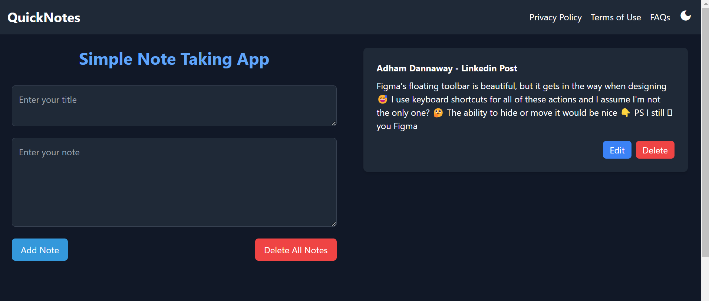
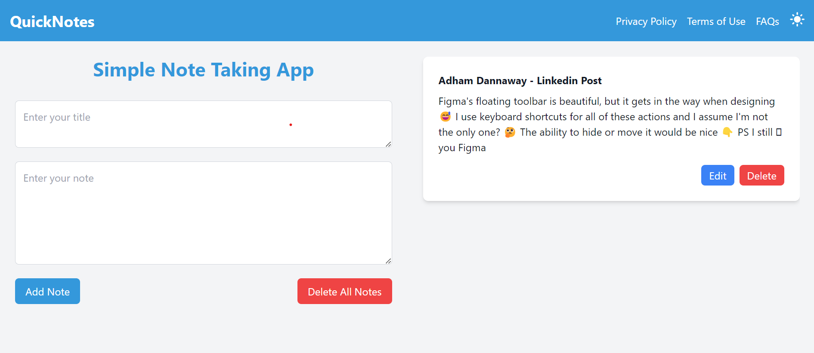
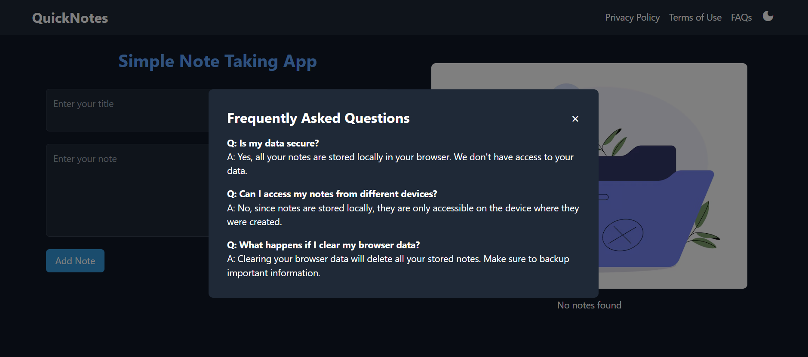
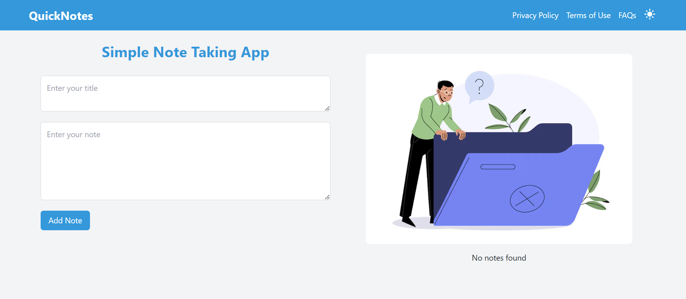

# QuickNotes - Simple Note Taking App

## Current Version (v1.0)

QuickNotes is a simple and efficient note-taking app designed to help you capture and organize your thoughts quickly and easily.

### Features:
- **Add Notes**: Easily add text notes with a simple and intuitive interface.
- **Edit Notes**: Edit your existing notes with ease.
- **Delete Notes**: Remove notes that are no longer needed.
- **Dark Mode**: Toggle between light and dark modes for comfortable viewing.
- **Privacy First**: All notes are stored locally in your browser's storage.
- **Responsive Design**: Optimized for both desktop and mobile devices.

## Projected Version (v2.0)

QuickNotes v2.0 is set to revolutionize your note-taking experience with advanced features and integrations.

### Planned Features : To convet into an mobile app - with ai - TBR
- **AI and LLMs Integration**: Utilize artificial intelligence to enhance note-taking and content organization.
- **Vector DB Connections**: Seamlessly connect with vector databases for efficient data handling.
- **GPT Content Refactoring**: Intelligent content refactoring to improve your notes.
- **In-Depth Research Tools**: Enhanced tools for thorough research and data analysis.
- **Voice and Image Upload**: Support for voice notes and image uploads.
- **Audio and Video Extraction**: Extract and utilize content from audio and video files.
